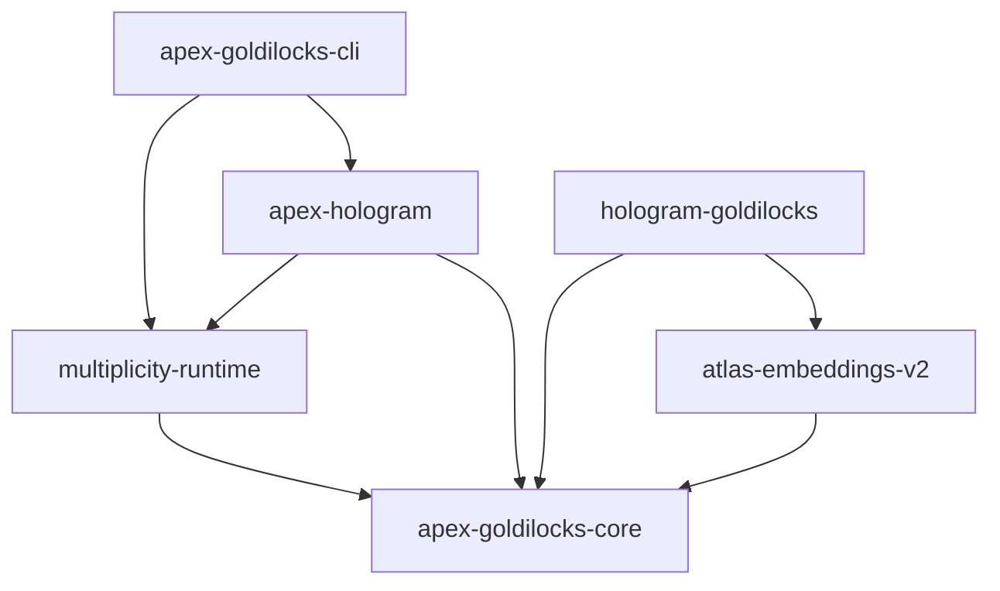

# Apex Goldilocks Architecture

This document specifies the architecture of the `apex-goldilocks` workspace, a high-integrity compute stack built on top of prime-field arithmetic. This workspace is a complete, float-free rewrite of the legacy `projects/apex` stack, designed to eliminate float leakage and maintain strict L0 invariants.

---

## 1. Core Principles

1.  **Field-Centric Arithmetic**: All compute and representation logic operates strictly within the Goldilocks Prime Field:
    $$\mathbb{F}_p = \mathbb{Z}/p\mathbb{Z} \quad \text{where} \quad p = 2^{64} - 2^{32} + 1$$
2.  **Zero-Float Policy**: Floating-point types (`f32`, `f64`) are prohibited in the core logic. Any floating-point representation must be replaced with exact field elements or integer-scaled values.
3.  **Sealed Certification Rails**: Transition and scheduling are certified via the $12,288$ Boundary Lattice, mapping to the canonical $R_{96}$ resonance classes.

---

## 2. Workspace Structure

The workspace is structured into six modular crates:

```
projects/apex-goldilocks/
├── crates/
│   ├── apex-goldilocks-core/    # Field vector space, boundary lattice, and R96 classes
│   ├── multiplicity-runtime/    # ACE/PETC execution engine and the Neural Harness
│   ├── apex-hologram/           # PhiAddress resolutions and recursive AEP proof structures
│   ├── atlas-embeddings-v2/     # Exceptional Lie group root systems and E8 embeddings
│   ├── hologram-goldilocks/     # GPU/VGPU boundary and thickness mapping adapters
│   └── apex-goldilocks-cli/     # Command-line interface for audits and pilot execution
```

### Crate Architecture Mapping



---

## 3. Mathematical Foundations

### 3.1 The 12,288 Boundary Lattice
The classical computational horizon is bounded by the lattice:
$$\mathcal{G} = \mathcal{P} \times \mathcal{B} \quad \text{where} \quad \mathcal{P} = \mathbb{Z}/48\mathbb{Z}, \quad \mathcal{B} = \mathbb{Z}/256\mathbb{Z}$$
$$|\mathcal{G}| = 48 \times 256 = 12,288$$

-   **URef Subgroup**: An abelian subgroup $U_{\text{ref}}$ of order $2,048$ acts freely on $6$ disjoint orbits generated by canonical anchors:
    $$\mathcal{A} = \{(0, 0), (8, 0), (16, 0), (24, 0), (32, 0), (40, 0)\}$$
-   **Resonance Partitioning**: The $12,288$ elements are partitioned into $96$ resonance classes ($R_{96}$) with $128$ elements per class:
    $$R_{96}(p, b) = 2p + (b \bmod 2)$$

### 3.2 Neural Harness Stratum
To allow for neuroplastic adaptation without compromising the L0 invariants, we define the **Neural Harness** stratum. This layer is positioned strictly above the representation and certification rails.

-   **EchoBraid States ($\Theta$)**: Iterative state transitions:
    $$\Theta(t+1) = \Xi(\Theta(t))$$
-   **Veto-Enforced Adapter**: The `HarnessAdapter` acts as a unidirectional gatekeeper that validates adaptation proposals against:
    1.  **Multiplicity Capacity**: Proposed state dimension must not exceed the current `prime_index` bound.
    2.  **Spectral Witness**: Must provide a valid Tier 4 spectral witness ($\text{spectral\_healthy}(w)$).
    3.  **ACE Budget**: Must not deplete the allocated Power Iteration budget.

---

## 4. Invariant Enforcement

Validation is enforced statically and dynamically:
-   **Statically**: Build checks and CI workflows verify code structure.
-   **No-Float Script**: A pre-commit hook `enforce_no_floats.sh` inspects the crate source tree for any literal float declarations (`f32`/`f64`).
-   **Dynamically**: Unit and integration tests verify the free action of $U_{\text{ref}}$, $R_{96}$ class distribution, and EchoBraid veto pathways.
